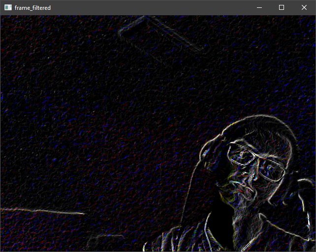
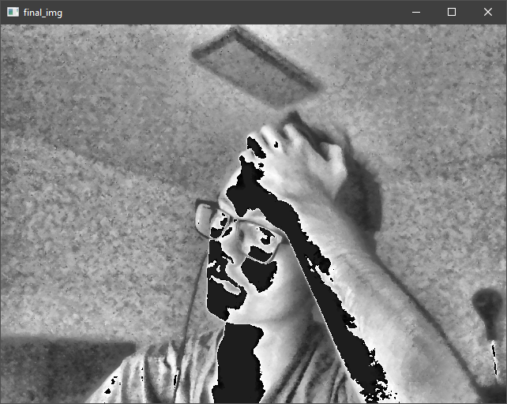
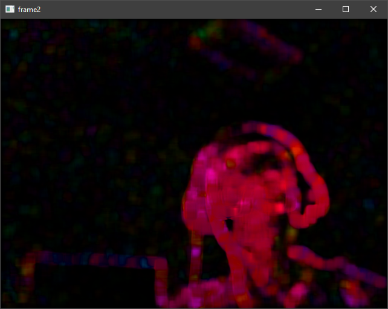
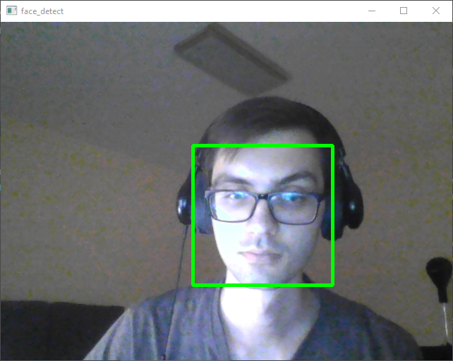

# CV2-training
Проекты для практики в компьютерном зрении
======================
В этой папке собрано несколько кусков кода делающих интересные штуки

2d свертка изоражения с ядром для выделения перепадов цветов и краев объектов

Тестирование метода адаптивной коррекции гистограммы (CLAHE) 

Определение движущихся точек и направления их движения на основе Lucas-Kanade

Применение каскадных классификаторов Хаара для детекции лица
(каскад haarcascade_frontalface_default.xml)

Нахождение ключевых точек и детекция объекта с алгоритмом SIFT

